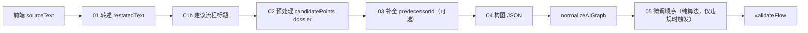

# File2Flow 与 Chat2Flow 算法说明（当前原型）

本文描述本仓库 **当前实现** 中：从「上传文件」和/或「描述/粘贴文本」生成工作流图（nodes + edges）的完整路径。二者共用 **同一套后端算法**；区别仅在于 **浏览器侧如何拼出 `sourceText`**。

---

## 1. 总览

| 模式 | 用户操作 | `sourceText` 构成 | 入口 |
|------|-----------|-------------------|------|
| **Chat2Flow**（纯文本） | 在「创建新流程」里填写描述/政策正文，可不传文件 | 仅 `desc`（描述框内容） | `public/js/admin/components.js` → `NewFlowModal.startAnalysis` |
| **File2Flow** | 上传 `.docx` / `.txt`（可选仍填描述、链接） | `desc` 与 `fileText` 用两个换行拼接 | 同上 |
| **混合** | 既有描述又有文件 | `desc\n\nfileText` | 同上 |

服务端入口均为 **`POST /api/flows`**（`server.mjs`），请求体 JSON 字段：

| 字段 | 含义 |
|------|------|
| `name` | 流程名草稿（前端用描述首行或文件名；后端在 **01b** 可用转述文重写为列表展示名） |
| `sourceUrl` | 可选来源链接 |
| `sourceFile` | 可选原始文件名（元数据，写入 flow） |
| `sourceText` | 前端合并后的**原始**正文（见下文；后端会先转述再在部分步骤中使用） |
| `debugFile2flow` | 可选 `true`；写入 `data/file2flow-debug-last.json` 并在响应中带 `file2flowDebugPath` |

**不存在**单独的「chat 意图分类」或第二条 API。

### 1.1 后端流水线（主链路 + 解析失败时 JSON 修复）

**无字符分段**；`00-source-segmentation*.md` 已停用，主流程不调用。



| 步骤 | 提示词文件 / 函数 | `callAi` | 输入要点 |
|------|-------------------|----------|----------|
| 1. 转述 | `prompts/file2flow/01-source-restatement.md` | 是（可跳过） | 固定英文指令 + `---` + **原始** `sourceText` |
| 1b. 标题 | `prompts/file2flow/01b-flow-title-from-restatement.md` | 是（可跳过） | 转述全文 + 前端草稿 `name` / `sourceFile` → **简洁名**（含文书类型）；写入 `pipelineInput.name` 并覆盖最终 `flowName` 与 DEFINITION 节点 `label` |
| 2. 预处理 | `prompts/file2flow/02-source-preprocess.md` | 是（可跳过） | **转述后**全文 `{{SOURCE_TEXT}}` → `candidatePoints`、分支 dossier 等 |
| 3. 候选点补全 | `prompts/file2flow/03-complete-candidate-points.md` | 是（可跳过） | **原始**正文 + 转述文 + `candidatePoints` JSON；可新增点、补 `predecessorId` |
| 4. 构图 | `prompts/file2flow/04-graph-from-source.md` | 是 | 转述全文 + **formatPreprocessDossier** 注入段 |
| **5. 微调顺序** | **`restructureDecisionsBeforeActions()`**（server.mjs） | **否** | normalize 后的图；强制 `DEFINITION → DECISION* → (ACTION\|PEOPLE)*` 形状；仅检测到违规时重写 |
| — | `prompts/file2flow/05-json-repair.md` | 仅 **JSON 解析失败** | 预处理 / 补全 / 构图 任意一步坏 JSON 时的修复提示 |

**构图提示**要求与 **candidatePoints** 逐项对应（lockstep）：每个候选点对应一个 `nodes[]` 项，`tempId` = 该点 `id`（如 `pt-1`）；按 `predecessorId` 连边；同一 DECISION 多子节点时需多 answer + 多出口边（见模板正文）。

---

## 2. 前端：输入准备（File2Flow / Chat2Flow）

**文件**：`public/js/admin/components.js`（`NewFlowModal`）、`public/js/admin/helpers.js`（`extractUploadTextForAi`）。

### 2.1 校验

- 合并后 `sourceText.trim()` 为空则报错：须至少提供 **描述**、**上传文件正文** 或 **粘贴正文** 之一。

### 2.2 文件 → 纯文本（仅 File2Flow 分支）

`extractUploadTextForAi(file)`（`public/js/admin/helpers.js`）：

- **`.txt`**：`File.text()`，UTF-8。
- **`.docx`**：`arrayBuffer` → **Mammoth** `extractRawText`（`public/admin.html`）。**禁止**对 docx 使用 `File.text()`。
- **`.pdf`**：浏览器 **pdf.js**（`admin.html` 加载 3.11.x + worker）逐页 `getTextContent` 拼接；纯扫描件无文字层时需 OCR 或改粘贴正文。
- **`.doc`（Word 97–2003）**：浏览器无法可靠解析，经 **`POST /api/extract-doc-text`**（JSON：`filename`、`base64`）由服务端 **`word-extractor`** 从缓冲区抽正文；体积上限约 **18 MB**。

### 2.3 合并规则

```text
sourceText = [desc, fileText].filter(Boolean).join("\n\n")
```

### 2.4 请求与 UI 反馈

- `POST /api/flows`，body：`name`, `sourceUrl`, `sourceFile`, `sourceText`；调试可加 `debugFile2flow: true`（Admin URL **`?file2flowDebug=1`** 会自动带上）。
- **进度**：弹窗内 **「AI 进行中」** 清单共五步视觉节奏：**转述 → 提取节点 → 补全节点前置关系 → 生成工作流 → 检查工作流**（计时器大致推进；实际后端在预处理与构图之间多一次补全 LLM）。
- 失败信息留在弹窗红色区域。

---

## 3. 后端：`generateGraph` 详解

**核心文件**：`server.mjs`（`restateSourceTextForFile2flow`、`analyzeSourceTextStructure`、`completeCandidatePointsWithLlm`、`buildGraphPrompt`、`normalizeAiGraph`、`validateFlow`）。

**提示词目录**：`prompts/file2flow/`（每次请求读盘；`<!-- ... -->` 注释不会发给模型）。目录说明见 `prompts/file2flow/README.md`。

### 3.1 步骤 1 — 自然语言转述

函数：**`restateSourceTextForFile2flow(fullSource, config)`**

- 读取 **`01-source-restatement.md`**（项目约定：**不修改**该文件正文）。
- 实际 prompt = `{文件全文}\n\n---\n\n{原始 sourceText}`。
- 模型应只输出两节：**1. Document Definition**、**2. Signing Process**。
- 结果 **`restatedText`** 写入 `pipelineInput.sourceText`，供 **预处理、构图** 使用；**补全候选点**步骤另传 **原始** `fullSource`。
- **`AI_SKIP_SOURCE_RESTATEMENT=1`**：跳过本步，`restatedText` = 原始 `sourceText`。
- 转述结果为空则 **抛错**。

### 3.1b 步骤 1b — 根据转述建议流程标题

函数：**`suggestFlowTitleFromRestatement(restatedText, input, config)`**

- 提示词：**`01b-flow-title-from-restatement.md`**；`{{RESTATED_TEXT}}` 为转述全文（服务端截断约 12k 字符）；`{{DRAFT_TITLE}}`、`{{SOURCE_FILE}}` 为前端草稿，供模型对齐语气与缩写。
- 成功则 **`pipelineInput.name`** 使用该标题，后续 **`{{FLOW_NAME}}`** 均用新名；`normalizeAiGraph` 之后 **`flowName`** 与该标题对齐，且 **DEFINITION** 节点的 **`label`** 同步为该标题（首卡标题一致）。
- 模型输出解析为单行标题（去引号 / 列表符）；失败或跳过时仍用前端 `name`。
- 转述后正文 **不足 48** 字符时不调用标题 LLM。
- **`AI_SKIP_FLOW_TITLE_FROM_RESTATEMENT=1`**：跳过本步。

### 3.2 步骤 2 — 源结构预处理（提取 candidatePoints）

函数：**`analyzeSourceTextStructure(pipelineInput, config)`**

- 提示词：**`02-source-preprocess.md`**，`{{SOURCE_TEXT}}` = **转述后全文**。
- 期望 JSON 字段（节选）：
  - **`candidatePoints`**：`id`, `title`, `likelyKind`, `rationale`, `predecessorId`
  - **`segmentation`**、**`earlyForks`**、**`decisionOutgoingAudit`**、**`graphBuilderBrief`**
- 转述后 `sourceText.trim().length < 64`：**不调用**预处理 LLM（`skipped: true`）。
- **`AI_SKIP_SOURCE_PREPROCESS=1`**：跳过；无 dossier，构图仅靠转述 + 规则。
- JSON 解析失败：`repairJsonWithAi`（**`05-json-repair.md`**）→ `repairCommonJsonIssues`；仍失败则 `parsed: null`，**不阻断**（仅无 dossier）。

### 3.3 步骤 2b — 补全候选点前置（`predecessorId`）

函数：**`completeCandidatePointsWithLlm(originalSource, restatedSource, preprocessParsed, …)`**

- 在预处理 **成功** 且存在非空 `candidatePoints` 时执行（**`AI_SKIP_CANDIDATE_POINT_COMPLETION=1`** 跳过）。
- 提示词：**`03-complete-candidate-points.md`**；用 **原始** `sourceText` 与当前列表让模型补链、必要时 **新增** 候选点。
- 解析失败仅 `console.warn`，**不阻断**；合并结果写回 `mergedPreprocessParsed`，再交给 **`formatPreprocessDossier`**。

### 3.4 `formatPreprocessDossier`（注入构图）

- **优先输出 `candidatePoints` JSON**（标题注明须一节点一 `tempId`），避免旧版「前文过长 + 总长度 14k」把 **列表截断在中途** 导致构图只见到前几个点。
- 常量（`server.mjs`）：**`FILE2FLOW_DOSSIER_CANDIDATE_POINTS_MAX_CHARS`**（默认 28k 量级）、**`FILE2FLOW_DOSSIER_MAX_CHARS`**（总帽，默认约 52k）；其余段落（`graphBuilderBrief`、`segmentation` 等）依次追加并可能再截断。
- 可选字段 **`candidatePointCompletionNotes`** 来自补全步骤的 `completionNotes`。

### 3.5 步骤 3 — 构图 JSON

函数：**`buildGraphPrompt(pipelineInput, preprocessDossier)`** + **`callAi`**

- 模板：**`04-graph-from-source.md`**。
- **`{{SOURCE_TEXT}}`**：**转述后**全文（非原始上传正文）。
- **`{{PREPROCESS_DOSSIER_SECTION}}`**：注入上节的 dossier（强调 `candidatePoints` lockstep 与 `predecessorId` 连边规则）。

### 3.6 解析、修 JSON、归一化

- 构图输出：`extractJsonCandidate` → `JSON.parse`；失败则 **`05-json-repair.md`** → `repairCommonJsonIssues`；仍失败则 **抛错**（弹窗展示）。
- **`normalizeAiGraph`**：`tempId` → 持久 `id`，过滤无效边，网格布局。
- **缺失节点的兜底**（不阻塞生成）：
  - 缺 **DEFINITION** → 用 `pipelineInput.name` / `flowName` / 推断标题合成一个，并接到第一个无入边的非 PEOPLE 节点（优先 DECISION）作为入口。
  - 缺 **ACTION** → 合成占位 `Action — to be defined`，优先接到某个 DECISION 中尚无 outgoing 的 answer 端口；都没有则直接挂在 DEFINITION 下。
  - 合成事件写入 `console.warn` 与 `step4_normalizedGraph.synthesizedNodeTypes`；UI 不报错，admin 进画布后可手动修正。

### 3.6b 步骤 5 — 微调顺序（`restructureDecisionsBeforeActions`）

研究员端的体验是「先答完所有问题，再看到所有 action / contact」。这一步把图强制改成：

```
DEFINITION → DECISION* → (ACTION | PEOPLE)*
```

每条从 DEFINITION 到叶子的路径都必须先经过 **0 个或多个 DECISION**，然后才能出现 ACTION/PEOPLE，且 **ACTION/PEOPLE 之后不允许再出现 DECISION**。

**算法**（纯本地，无 LLM）：

1. **检测违规**：DFS from DEFINITION，标记任何 `(ACTION ancestor) → DECISION` 的边。无违规直接返回原图（pass-through）。
2. **枚举路径**：DFS 列出所有 DEFINITION → leaf 的简单路径，每步记录 `(nodeId, portToNext)`（decision 的 port = answer id）。
3. **重写每条路径**：把路径拆成 `decisions[]`（保原顺序）+ `actions[]`（保原顺序），重组为 `def → decisions → actions`。
4. **节点处理**：
   - **DECISION 共享**：每个 decision 在最终图里只出现一次（按 id 去重）；
   - **ACTION / PEOPLE 克隆**：每条路径自带一份独立 clone（id 加 `__pX_Y` 后缀）。这样保证不同终端答案分别对应一条独立的 action 链，研究员遍历时不会跨答案混淆。
5. **边去重**：按 `(source, sourceAnswerId, target)` 去重；decision 间的边共享，clone 之间的边天然唯一。
6. **孤立节点**：原图里不可达的节点原样保留。

**Port 语义保留**：原路径上 decision 的某个 answer port 引向了下一节点 —— 重写后，同一个 port 引向下一个 decision（如果有）或第一个 action clone。研究员遍历逻辑不需要改。

**已知不足**：算法只重排，不修改节点内容。如果 AI 把"实质是判断"的步骤标成了 ACTION（例如 "Determine if X" 后面紧跟一个 DECISION），算法只能把它挪到 decisions 之后，无法把它转成 DECISION。这种语义级的修正需要后续 LLM 步骤或手工。

### 3.7 调试与落盘

| 文件 | 何时写入 | 主要内容 |
|------|----------|----------|
| **`data/file2flow-debug-last.json`** | `debugFile2flow: true` | 见下表 |
| **`data/file2flow-segments-candidates-last.json`** | 每次 `POST /api/flows`（`.gitignore`） | 预处理 + **补全** + `mergedPreprocessParsed`、`dossierInjected` |

**`file2flow-debug-last.json` 主要字段**：

| 字段 | 含义 |
|------|------|
| `step1_inputEcho` | 原始 `sourceText` 等 |
| `step1b_restatement` | 转述 bundle |
| **`step1c_flowTitle`** | 标题建议：`prompt` / `rawAi` / `suggestedFlowTitle` / 跳过原因 |
| `step2_preprocess` | 预处理 bundle |
| **`step2d_candidatePointCompletion`** | 补全步骤 bundle（或 env 跳过 / 错误） |
| `step2c_dossierStringInjectedIntoGraphPrompt` | 实际拼进构图 prompt 的 dossier |
| `step3_*` | 构图 prompt / 原始输出 / 解析 / 修复日志 |
| `step4_normalizedGraph` | 归一化后的图；含 `synthesizedNodeTypes: []`（被自动补出的节点类型，如 `["DEFINITION"]`） |
| **`step5_restructure`** | 微调顺序步骤：`changed` / `violations[]` / `pathCount` / `cloneCount` / `graphAfter`（仅 changed 时含图） |

### 3.8 环境变量

| 变量 | 作用 |
|------|------|
| `AI_SKIP_SOURCE_RESTATEMENT=1` | 跳过转述 |
| `AI_SKIP_FLOW_TITLE_FROM_RESTATEMENT=1` | 跳过 **01b** 标题 LLM |
| `AI_SKIP_SOURCE_PREPROCESS=1` | 跳过预处理 LLM |
| **`AI_SKIP_CANDIDATE_POINT_COMPLETION=1`** | 跳过候选点补全 LLM |
| **`AI_SKIP_DECISION_REORDER=1`** | 跳过步骤 5 微调顺序（即使图有违规也保留原结构） |
| `AI_PROVIDER` / `AI_API_KEY` / `AI_MODEL` | AI 配置 |
| `AI_MAX_OUTPUT_TOKENS_*` | 各提供商输出 token 上限 |

### 3.9 与参考方案差异 / 未使用路径

- 主链路：**转述 → 建议标题 → 预处理 →（可选）补全候选点 → 构图 → 归一化 → 微调顺序**；无字符分段。
- **`segmentSourceTextWithLlm` 等**：代码库可能仍存在，**主流程不调用**。

---

## 4. 校验、画布与 Researcher

### 4.1 `validateFlow`（`POST /api/flows` 不阻塞 201）

- **错误（errors）**：仍包括唯一 `DEFINITION`、DEFINITION 入/出边规则、`DECISION` **死分支**（某 answer 无出边）、`ACTION` **出边 >1**、至少一个 `ACTION` 等。
- **警告（warnings）**（放宽「全连通」假设）：
  - 节点 **无任何入出边**（仅画布占位）→ warning
  - **`ACTION` / `DECISION` 无入边**（并行或未接线路径）→ warning
  - **从 DEFINITION 沿边不可达任何 `ACTION`** → warning（画布上仍可有其他 `ACTION`）

### 4.2 Admin 画布

- `FlowCanvas` 校验：无入边的 **`action`** / **`decision`** 为 **warning**（不再当作发布阻塞 error）。
- 保存/发布前：`builderGraphToBackendFlow`。

### 4.3 Researcher

- **`GraphDocWizard`**、**`findAllTerminalPaths`**：详见 `CLAUDE.md`。
- 仅 **`PUBLISHED` + `PUBLIC`** 进入知识库。

---

## 5. 限制与注意事项

1. **主链路多次 LLM 调用**（通常：转述 + **建议标题** + 预处理 + 补全 + 构图），耗时长、成本高；可用环境变量跳过前几步做调试。
2. **构图行为**依赖模型遵守 **`04-graph-from-source.md`** 的 lockstep；dossier 已加大 `candidatePoints` 保留，减少「只看见前几个点」的截断问题。
3. **`validateFlow`** 只做结构级校验，不保证业务语义。
4. **PDF** 使用 pdf.js 抽取可视文本层；扫描件、乱码版式可能需 OCR 或粘贴正文。
5. **`.doc`** 经服务端 `word-extractor`；异常文件可另存 **.docx** 再试。
6. **上下文长度**受模型窗口限制。

---

## 6. 关键文件索引

| 环节 | 路径 |
|------|------|
| 弹窗与请求 | `public/js/admin/components.js`（`NewFlowModal`） |
| 文件抽取 | `public/js/admin/helpers.js`（`extractUploadTextForAi`） |
| Mammoth / pdf.js | `public/admin.html` |
| 生成主逻辑 | `server.mjs`（`generateGraph`、`POST /api/extract-doc-text`） |
| 提示词 | `prompts/file2flow/*.md` |
| Debug | `data/file2flow-debug-last.json` |
| 候选 / dossier 快照 | `data/file2flow-segments-candidates-last.json` |

文档版本：与当前 `generateGraph`（含候选点补全、dossier 拼接策略、`04/05` 提示词编号）同步；改契约时请一并更新 **`prompts/file2flow/README.md`** 与 **`CLAUDE.md`**（若涉及）。
